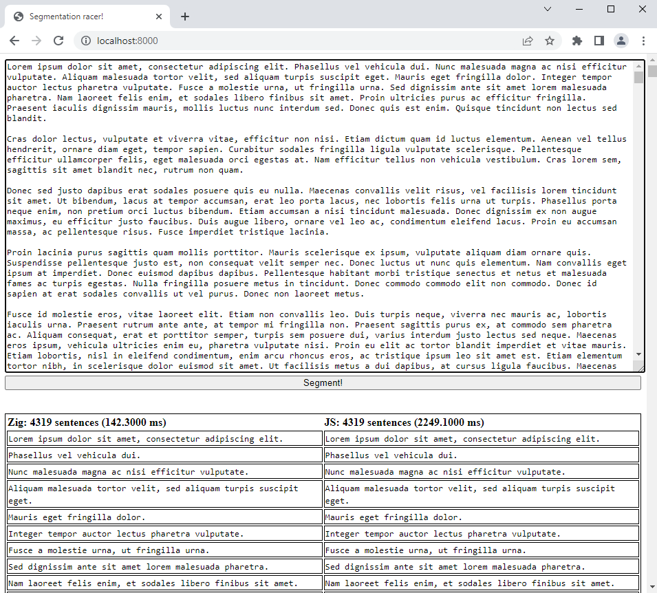

# segmentation-racer
Race sentence segmenters in the browser! Zig vs JS!

One sentence segmenter is built using Zig which is compiled to `Wasm`. 

And the other uses the segmenter available in JavaScript [Intl.Segmenter](https://developer.mozilla.org/en-US/docs/Web/JavaScript/Reference/Global_Objects/Intl/Segmenter) (Not supported in Firefox)

## Usage

The required `zig-out/lib/segmentation-racer.wasm` file is already built, so just start a simple HTTP server.

```bash
python -m http.server
```

Navigate to http://localhost:8000

## Build

```bash
zig build -Dtarget=wasm32-freestanding -Doptimize=ReleaseFast
```

If you need Zig it's super simple to install: https://ziglang.org/learn/getting-started/

This repo is confirmed to work using `master` with version:

```bash
> zig version
0.11.0-dev.4059+17255bed4
```

## Test

There are no proper tests but here is how you run them.

```bash
zig build test
```

## Preview

Zig + Wasm is faster on larger documents and works in all browsers :^)

